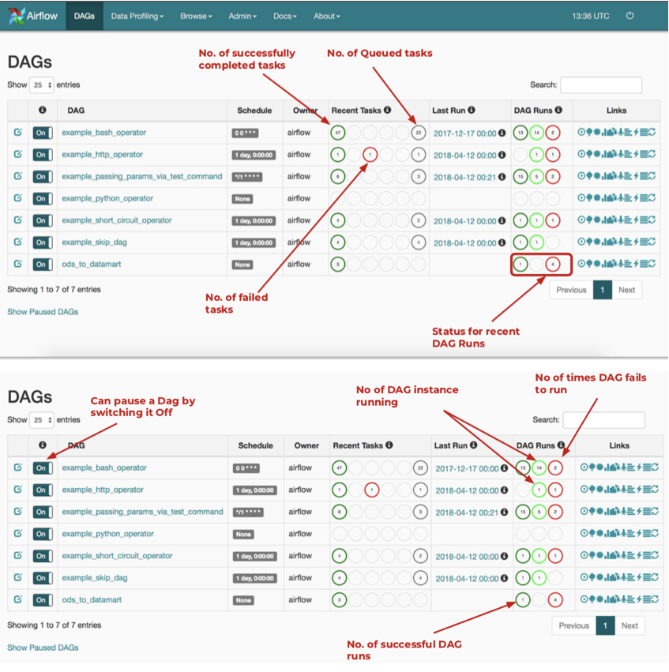
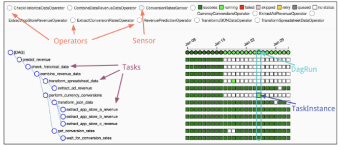
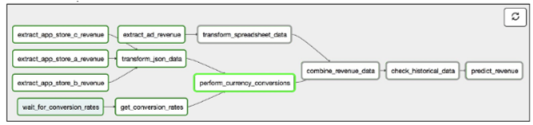
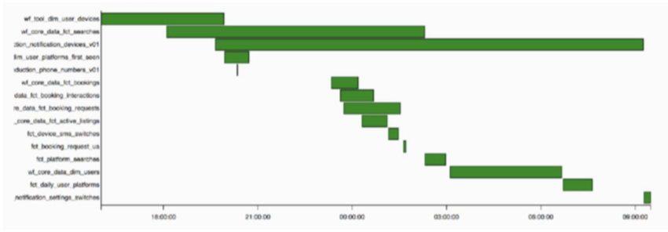
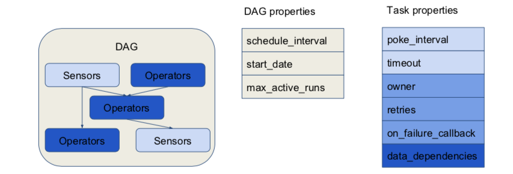
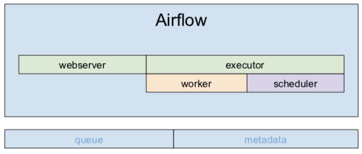

[TOC]


# Airflow for Data Science

## 0. References

- [Beyond CRON: Intro to WMS - Dustin Stansbury](https://medium.com/@dustinstansbury/beyond-cron-an-introduction-to-workflow-management-systems-19987afcdb5e)
- [Airflow in the Cloud - PyData London 2018](https://speakerdeck.com/kaxil/apache-airflow-in-the-cloud-programmatically-orchestrating-workloads-with-python-pydata-london-2018)
- [Developing Elegant Workflows - Michal Karzynski](https://speakerdeck.com/postrational/developing-elegant-workflows-with-apache-airflow)
- [How I learned to time travel - Laura Lorenz](https://www.youtube.com/watch?v=60FUHEkcPyY)
- [Airflow for the confused](https://blog.capitalplanning.nyc/apache-airflow-for-the-confused-b588935669df)
- [Automated Model Building with EMR, Spark and Airflow](https://www.agari.com/identity-intelligence-blog/automated-model-building-emr-spark-airflow/)
- [A Beginners Guide to Data Engineering](https://medium.com/@rchang/a-beginners-guide-to-data-engineering-part-i-4227c5c457d7)
- [Airflow on Kubernetes](https://kubernetes.io/blog/2018/06/28/airflow-on-kubernetes-part-1-a-different-kind-of-operator/)
- [Airflow and Kubernetes Operators](https://medium.com/bluecore-engineering/were-all-using-airflow-wrong-and-how-to-fix-it-a56f14cb0753)

## 1. Why Data Pipelines?

Enterprise Data and software products (like forecast reports and sales dashboards) depend on the execution of complex workflows of tasks that catch, transform, move, analyze and display data to strategic decision makers. A workflow is just a sequence of tasks started on a schedule or triggered by an event. Workflow management systems help us organize and execute tasks that may have different dependencies, start times and durations.


Most data science projects consist of a set of tasks - obtain, scrub, explore, model, industrialize. It is trivial to stitch together and automate these tasks in a  workflow. But data is unpredictable and can cause some tasks or entire pipelines to fail. Sometimes servers die, APIs fail and connections are dropped.

For building robust and resilient pipelines, we need a system that has

-  *Smart Scheduling* to accommodate tasks with varying start-times and durations
- *Dependencies Management* to easily define upstream and downstream tasks, consider priorities, and execute tasks in parallel where possible
- *Resilience* to retry failed tasks based on state or timeouts and alert the team
- *Scaleability* to accommodate more workflows and allow particular tasks to be run on specially allocated resources
- *Flexibility* to run anything you want, and to hack and extend where needed
- *Monitoring and Interaction* to provide centralized access via a UI to task statuses (completed, running, succeeded, failed, retrying ...) 
- *Batteries included* so the tool is fairly plug and play, with most requirement fulfilled out-of-the-box
- *Open Source, Python native*
- *Great documentation, Community support*

## 2. Overview of available Tools


### Files and Targets based systems

- Examples: Make, Drake, PyDoit, Luigi
- Pros
  - Work is cached in files so rebuilding is easy
  - Simple and intuitive configurations especially for data transformations
- Cons
  - No native concept of scheduling (can use `cron`)
  - Primitive alerting systems
  - Restrictive design; not easily applicable to non-file targets

###Abstract Orchestration systems 

- Examples: Pinball, Airflow
- Pros
  - More types of Operations possible
  - Handle more complex dependency logics
  - Scheduling, monitoring and alerting services are built-in
- Cons
  - Caching is per service, the focus is not on individual tasks
  - Configuration is not that easy
  - More infrastructure dependencies like a databse for stroring task-states and a queue for handling task distribution

## 3. Why Airflow?

> Airflow is a platform to programmatically author, schedule and monitor workflows.

There's a focus on '**programmatically authoring**' - to build things that are more dynamic and easily reviewed. Airflow provides tools to build data pipelines on-the-fly, allowing us to write workflows-as-code. It can be seen more as an orchestrator that triggers jobs on other systems. 

With Airflow it becomes possible to specify rules or requirements (in a YAML or a through front end) that can be parsed and used to generate a workflow automatically. You go from being a workflow-author to being a workflow-factory (writing applications that generate pipelines), thus commoditizing the work of Data Engineers and scaling it up.

### Features

- DAGs are configured via code, new tasks can be generated on-the-fly. Everything is a Python object.
- Scheduler process handles triggering and executing work specified in DAGs on a calendar or cron-like schedule
- Built-in *alerting* based on SLAs (like timeouts) or task-state (Slack or email notification integration) 
- Parameterized retry - the pipeline self-heals when tasks fail and applications crash
- *Great UI* with lots of sexy profiling visualizations to monitor DAGs, execution status and run durations of tasks
- Actions on DAGs like `test, backfill, clear, trigger` are convenient from the CLI 
- Variety of available *Operators* and the ability to extend them using inheritance 
- *Scalable* - supports local (Sequential) or distributed (Celery) execution
- *Variables* for setting and storing configurations referenced by tasks

### Screenshots

- DAGs overview



- Tree View



- Graph View helps visualize task dependencies and status for a specific run



- Gantt Chart to discover tasks that are blockers



## 4. Concepts



### DAGs

- Airflow uses Directed Acyclic Graphs to represent workflows. DAGs are collections of tasks with their dependencies. 
  (circular dependencies are not allowed as they will create infinite execution loops)
- Each node in the graph is a task, and edges define dependencies amongst tasks. DAGs sets the context for when and how the tasks should be executed
- These are defined in Python scripts and places inside the `dags/` directory inside `$AIRFLOW_HOME`. They are picked up by the scheduler automatically.

#### DAG Parameters

- `dag_id` is the unique string identifier.
- `start_date` the point in time when the DAG's tasks are to be started. Valid Python datetime values allowed. 
- `schedule_interval` how often are the tasks to be executed. Can take cron strings, timedelta objects or special strings like `@daily`
- `default_arguments` are inherited by all tasks in the DAG
  - See the documentation for details on `depends_on_past`, `email_on_failure`, `max_active_runs`

```python
# Set default args
defaultargs_ = {
    'owner': 'dkhosla',
    'start_date': datetime(2018, 8, 22),
    'depends_on_past': False,
    'email': ['blabla@bla.com'],
    'email_on_failure': True,
    'retries': 1,
    'retry_delay': timedelta(minutes=5)
}

# Instantiate the dag
dag_1 = DAG(
    dag_id='dag_1',
    default_args=defaultargs_,
    schedule_interval='@daily'
)
```

> NOTE
> The `start_date` specifies the datetime at which data will be present in the database. The first job will run at `start_date + interval` because that's when all the data for the specified interval will have arrived.

When a DAG is executed, it becomes a **DAG Run.** 

- Airow triggers this execution based on the `schedule_interval` defined in the DAG or after a manual trigger
- A DAG Run is logged, including when the run began, exited, and if any errors occurred along the way.

### Operators and Tasks

While DAGs describe *how to run* a workflow, Operators determine *what gets done.* Thus,  operators define the individual tasks that need to take place within a DAG. They can trigger bash commands, run SQL on a database, transfer data between systems, listen for changes on a server, or even send an email or Slack message.

Built-in Operators are categorized into 3 types

- *Action*: perform a particular action with data or pipeline
  Examples - `BashOperator`, `PythonOperator`, `EmailOperator`
- *Transfer*: move data in the pipeline
  Examples - `S3ToHiveTransfer`
- *Sensor*: test to determine if a state or requirement has been reached
  - Examples - `HttpSensor`, `ExternalTaskSensor`
  - Implemented as a Python class with a `poke()` method 
    which will be called repeatedly until `True`
  - Useful for monitoring external or long-running processes

**Custom Operators** can be extended using the `BaseOperator` class and need to have an `execute()` method defined.

#### Task Properties and Dependencies 

- **Properties** of a task include 
  - a unique `task_id`, 
  - the name of the `dag` it belongs to, and 
  - other Operator specific parameters. 
    For example, the `PythonOperator` requires a `python_callable=` argument.

- **Task dependencies** 
  - tasks can have multiple dependencies or none at all (independents)
  - dependencies are specified using the `set_upstream` or `set_downstream` methods. 
    The shorthands `>>, <<` can also be used.
  - Note that Airflow leverages the dependency graph to determine which tasks can be executed in parallel, and knows to prioritize parent tasks before running children.

```python
task_1 = BashOperator(task_id='sleep',  
                      bash_command='sleep 5')

task_2 = PythonOperator(task_id='get_raw_data',
                        python_callable=get_raw_data)

task_1.set_downstream(task_2)
```

#### Task Instance

- Airow calls an executed Operator a **Task Instance**. 
- It represents an attempted operation at a certain time, with certain parameters. 
- It’s log contains the exact command that was given to a worker, at what time, and the detailed output of what occurred.

> NOTE
> Each `DAGRun` and `TaskInstance` is associated with an entry in Airflow’s metadata database that logs their state (e.g. “queued”, “running”, “failed”, “skipped”, “up for retry”). 

### Airflow Execution



- At its core, Airflow is simply **a queuing system** built on top of **a metadata database**. 
- The **metadata database** stores task states

- The **Scheduler** uses DAG definitions in conjunction with the state of tasks in the metadata database to decide which tasks need to be executed as well as their execution
  priority.
- The **Executor** is tightly bound to the Scheduler and determines the worker processes that actually execute each scheduled task. There are two different *types of Executors*
  - The `LocalExecutor` executes tasks with parallel processes that run on the same machine as the Scheduler process. 
  - The `CeleryExecutor` executes tasks using worker processes that exist on a separate cluster of worker machines. 
- **Workers** are the processes that actually execute the logic of tasks, and are determined by the Executor being used.
- See the attached PDF for a quick walkthrough

### Advanced Concepts

- **Branching**
  - Use operators like `BranchPythonOperator` to divide workflow based on logic

```python
def choose():
	return 'first'

with dag:
    branching = BranchPythonOperator(task_id='branching', 
    								 python_callable=choose)
    branching >> DummyOperator(task_id='first')
    branching >> DummyOperator(task_id='second')
```

- **SubDAGs**
  - Certain task structures can be re-used for different data
  - These are kept inside a separate `/subdags` directory
  - Not discovered by the scheduler
- **Trigger Rules**
  Each Operator has a `trigger_rule` argument which can be set to one of 
  - `all_success` - default, all parents succeeded
  - `all_failed` - all parents in failed state
  - `one_failed` - fires as soon as any one parent fails
  - `one_success` - fires right after the first success upstream
- **XCom**
  - Abbreviation of “cross-communication” 
  - Means of communication between task instances
  - saved in the database as a pickled object
  - ideal for small pieces of data like IDs
- **Variables**
  - For storing and retrieving arbitrary content
  - Useful for storing configurations and settings 
  - Can be created, updated, deleted and exported to JSON from the UI

## 5. Environment setup

### Installation

```bash
conda install -y -c conda-forge airflow
# or; pip install airflow
# check documentation for more information

export AIRFLOW_HOME='/path/to/directory/containing/dags'
# make sure this variable is available before running airflow commands
# this could be placed in your .bashrc
```

### Setup

Modify the `airflow.cfg` file in `AIRFLOW_HOME` 

- Check the `dags_folder` line
- Set `load_examples=False`

### Airflow CLI

```bash
airflow version
# check if you're on the latest version

airflow initdb
# starts the metadata database and creates airflow.cfg, airflow.db

airflow list_dags
# get a list of the DAGs in your modules that will be picked up by the scheduler
# if there are errors in your code, they will be discovered here

airflow trigger_dag DAG_ID
# manually trigger a DAG run

airflow webserver
airflow scheduler
airflow worker
# to start the UI, scheduler, worker processes
# use '&> /dev/null &' to keep the shell 

airflow test DAG_ID TASK_ID EXECUTION_DATE
# for testing behavior of custom Operators in isolation, without affecting the database

airflow backfill DAG_ID TASK_ID -s START_DATE -e END_DATE
# for backfilling historical data without running the scheduler. Useful when the business logic changes for a currently running workflow

airflow clear DAG_ID
# for removing TaskInstance records in the database for a given DAG_ID

airflow resetdb
# for starting with a clean slate by restting the database, but not clearing logs
```

## 6. A simple pipeline

```python
from datetime import datetime, timedelta
from airflow import DAG
from airflow.operators.bash_operator import BashOperator
from airflow.operators.python_operator import PythonOperator
from airflow.operators.dummy_operator import DummyOperator

# Set default args
default_args = {
    'owner': 'dkhosla',
    'start_date': datetime(2018, 8, 22),
    'depends_on_past': False,
    'email': ['blabla@bla.com'],
    'email_on_failure': False,
    'email_on_retry': False,
    'retries': 1,
    'retry_delay': timedelta(minutes=5)
}

# Declare Python Functions
def print_hello():
    return 'Hello!'


# Instantiate the dag
dag_1 = DAG(
    dag_id='dag_1',
    default_args=default_args,
    schedule_interval=timedelta(days=1)
    )

# Instantiate Tasks
say_hello = PythonOperator(
    task_id='say_hello',
    python_callable=print_hello,
    dag=dag_1)

sleep = BashOperator(
    task_id='sleep',
    bash_command='sleep 5',
    dag=dag_1)

print_date = BashOperator(
    task_id='print_date',
    bash_command='date',
    dag=dag_1)

dummy = DummyOperator(
    task_id='dummy',
    retries=2,
    dag=dag_1)

# Set up the DAG
say_hello >> sleep >> print_date
sleep >> dummy
```

## 8. Productivity Tips

- Write functions (and Tasks) that always produce the same output for a given input. 
  - Avoid using global variables, random values, hardware timers. 
  - Explicitly state the order (for ex. using `ORDER BY`) rather than relying on the implicit ordering (for ex. in Python Dictionaries)
- Tasks should be **idempotent**, they should produce the same results when run with the same parameters every time, even  on different days. This reduces the possibility of unintended side effects when using rerty logic.
- Use features like 
  - `depends_on_past` when writing DAGs to ensure all upstream instances succeeded. 
  -  `LatestOnlyOperator` to conditionally skip some downstream steps if it's not the most recent execution of the workflow. 
  -  `BranchPythonOperator` allows you to choose which branch of the workflow is to be executed based on defined logic.
- Preserve outputs of upstream tasks as artifacts consumable by downstream tasks
- Use `airflow test <dag-id> <task-id> ...` often in early development to ensure your tasks run as intended
- To test your DAG with the scheduler, utilize the `@once` schedule_interval and clear the `DagRun`s and `TaskInstance`s between tests with `airflow clear`
- Before running CLI commands, make sure that your Python environment is activated and `AIRFLOW_HOME` is set for your session.
- When a DAG has been run, the database contains *instances* of that run. If you change the `start_date` or the `interval`, the scheduler may get confused. You should change the version of a DAG if you change its properties.
- Airflow uses **SLAs** to detect long-running (hanged) tasks and alerts you via Email or Slack. You can check the Web UI to inspect the missed SLAs further.
- **Sensors** like an HTTP Sensor or a File Sensor allow a workflow to wait for the appearance of a condition or data before continuing to run the DAG downstream.


## 


